# Manual de Usuario — BePro v1.0

Sistema de Reclutamiento y Selección de Personal

---

## Contenido

1. [Acceso al sistema](#1-acceso-al-sistema)
2. [Panel principal (Dashboard)](#2-panel-principal-dashboard)
3. [Módulo Usuarios](#3-módulo-usuarios)
4. [Módulo Clientes](#4-módulo-clientes)
5. [Módulo Candidatos](#5-módulo-candidatos)
6. [Módulo Colocaciones](#6-módulo-colocaciones)
7. [Roles y permisos](#7-roles-y-permisos)

---

## 1. Acceso al sistema

Al ingresar a la URL del sistema, serás redirigido automáticamente a la pantalla de inicio de sesión.

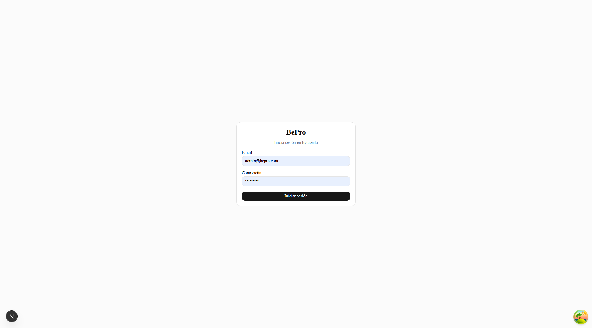

**Pasos:**
1. Ingresa tu **Email** registrado en el sistema
2. Ingresa tu **Contraseña**
3. Haz clic en **Iniciar sesión**

> Si las credenciales son incorrectas, el sistema mostrará un mensaje de error. Contacta al administrador si no recuerdas tu contraseña.

---

## 2. Panel principal (Dashboard)

Una vez autenticado, llegarás al panel principal. Desde aquí puedes navegar a todos los módulos disponibles según tu rol.


**Elementos del panel:**
- **Barra lateral izquierda** — Menú de navegación con los módulos disponibles para tu rol
- **Nombre y rol** — En la parte inferior izquierda se muestra tu nombre y rol asignado
- **Cerrar sesión** — Botón para salir del sistema de forma segura

> Los módulos visibles varían según el rol del usuario. Un Reclutador solo verá Candidatos; un Administrador verá todos los módulos.

---

## 3. Módulo Usuarios

> **Acceso exclusivo:** Administrador

Permite gestionar todos los usuarios del sistema: crear nuevos, visualizar roles y marcar si son freelancer.

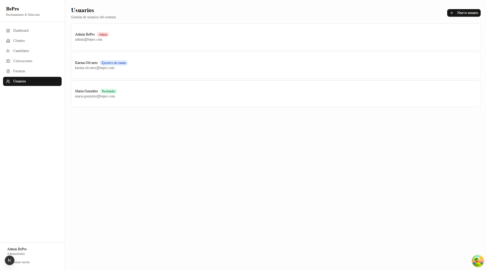

**Información mostrada por usuario:**
- Nombre completo
- Badge de rol (color según jerarquía)
- Badge "Freelancer" si aplica
- Badge "Inactivo" si el usuario fue desactivado
- Email

### 3.1 Crear nuevo usuario

Haz clic en **+ Nuevo usuario** para abrir el formulario.

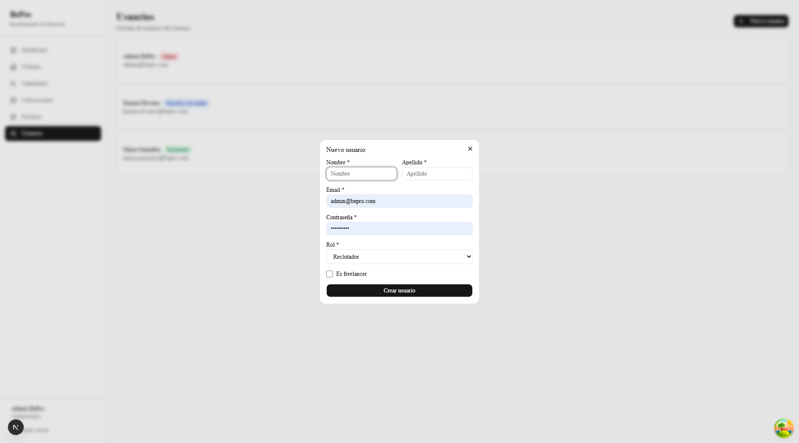

**Campos del formulario:**

| Campo | Descripción | Requerido |
|-------|-------------|-----------|
| Nombre | Primer nombre del usuario | Sí |
| Apellido | Apellido del usuario | Sí |
| Email | Correo electrónico (único en el sistema) | Sí |
| Contraseña | Mínimo 8 caracteres | Sí |
| Rol | Admin / Gerente / Ejecutivo de cuenta / Reclutador | Sí |
| Es freelancer | Casilla visible solo cuando el rol es **Reclutador** | No |

> El campo **Es freelancer** solo aparece cuando se selecciona el rol **Reclutador**. Al cambiar a otro rol, se desmarca automáticamente.

### 3.2 Resultado — usuario con badge Freelancer

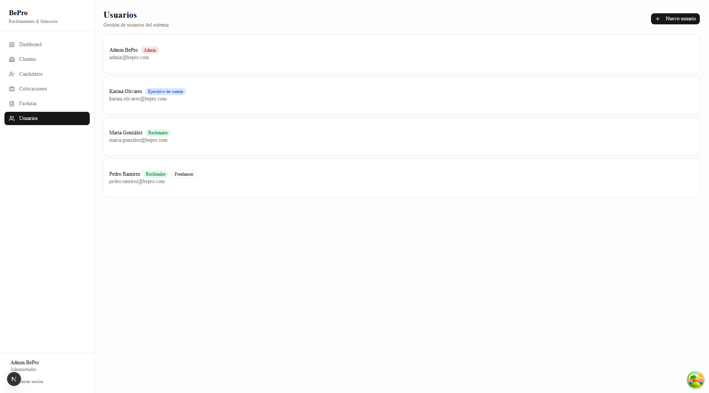

Los reclutadores freelancer aparecen con dos badges: **Reclutador** (verde) y **Freelancer** (contorno).

---

## 4. Módulo Clientes

> **Acceso:** Todos los roles (con vista filtrada por asignación para Ejecutivos y Reclutadores)

Gestión de las empresas cliente para las cuales BePro realiza reclutamiento.

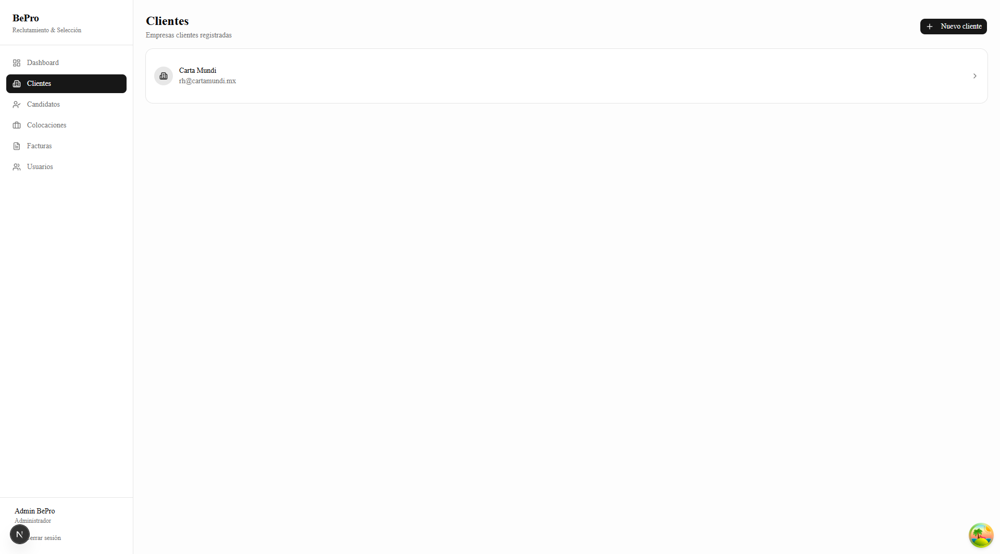

Haz clic en cualquier cliente para ver su detalle.

### 4.1 Detalle del cliente — Información

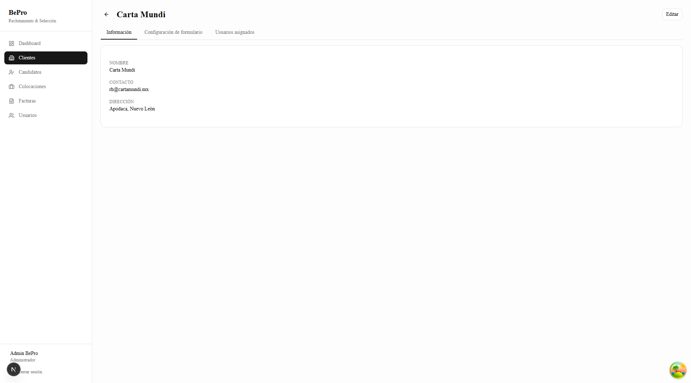

El detalle tiene tres pestañas:
- **Información** — Nombre, contacto y dirección
- **Configuración de formulario** — Campos visibles en el formulario de candidatos
- **Usuarios asignados** — Equipo de trabajo asignado a este cliente

### 4.2 Configuración de formulario

> **Permitido para:** Administrador

Cada cliente puede tener un formulario de candidatos personalizado. Esta pestaña permite activar o desactivar los campos opcionales que aparecerán al registrar un candidato para ese cliente.

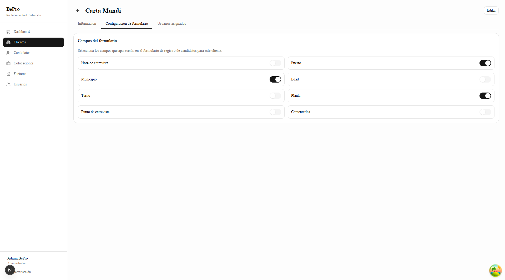

**Campos configurables:**

| Campo | Descripción |
|-------|-------------|
| Hora de entrevista | Hora específica de la cita |
| Puesto | Puesto o posición al que aplica |
| Municipio | Municipio de residencia del candidato |
| Edad | Edad del candidato |
| Turno | Turno de trabajo (matutino, vespertino, nocturno) |
| Planta | Planta o sucursal donde trabajará |
| Punto de entrevista | Lugar físico donde se realizará la entrevista |
| Comentarios | Campo libre para notas adicionales |

Los switches **activados** (negro) hacen que el campo sea **visible y requerido** en el formulario de registro de candidatos. Los desactivados simplemente no aparecen.

> Los cambios se guardan automáticamente al activar o desactivar cada switch. No hay botón de guardar.

### 4.3 Usuarios asignados al cliente

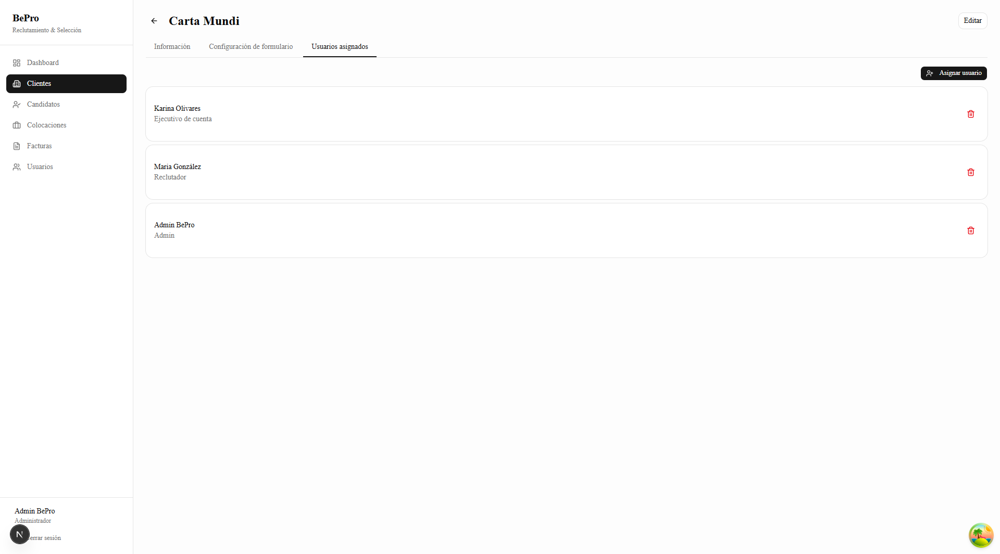

Muestra los usuarios del equipo asignados a ese cliente, con su rol. Desde aquí un Administrador o Gerente puede asignar nuevos usuarios o quitar asignaciones existentes.

### 4.4 Asignar usuario a un cliente

> **Permitido para:** Administrador, Gerente

Haz clic en **Asignar usuario** para abrir el dialog de asignación.

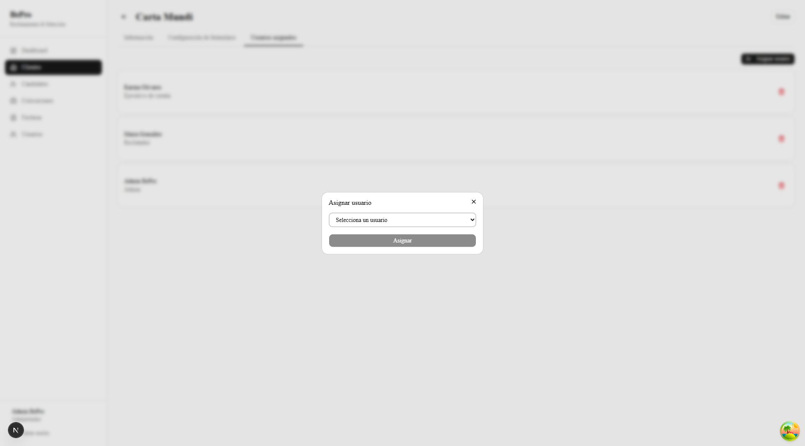

**Pasos:**
1. Selecciona el usuario del desplegable — solo aparecen los usuarios que **aún no están asignados** a este cliente
2. Haz clic en **Asignar**

Para **quitar** un usuario ya asignado, haz clic en el ícono de papelera (🗑) que aparece junto a su nombre en la lista.

---

## 5. Módulo Candidatos

> **Acceso:** Todos los roles

Registro y seguimiento de candidatos por empresa cliente.

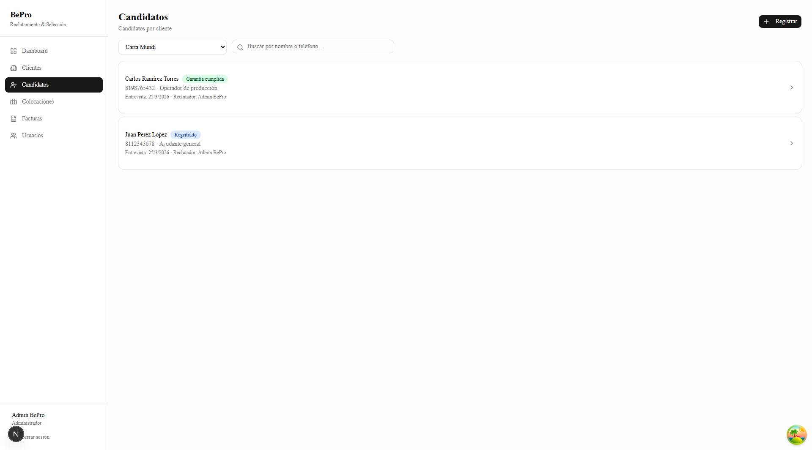

**Pasos para ver candidatos:**
1. Selecciona una empresa en el desplegable **Cliente**
2. Los candidatos de esa empresa aparecerán listados
3. Usa el campo de búsqueda para filtrar por nombre o teléfono

**Información visible en la lista:**
- Nombre del candidato
- Badge de estatus (color según estado)
- Teléfono y puesto
- Fecha de entrevista y reclutador asignado

### 5.1 Detalle del candidato

Haz clic en cualquier candidato para ver su información completa.

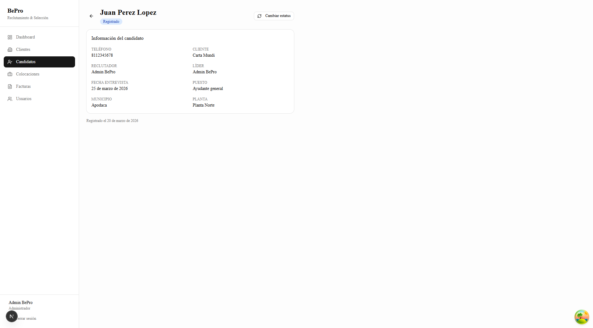

**Campos mostrados:**
- Teléfono, Cliente, Reclutador, Líder
- Fecha y hora de entrevista
- Puesto, Municipio, Planta, Turno, Edad
- Comentarios (si aplica)
- Fecha de registro

### 5.2 Cambiar estatus del candidato

> **Permitido para:** Administrador, Gerente, Ejecutivo de cuenta

Haz clic en **Cambiar estatus** para abrir el diálogo de transición.

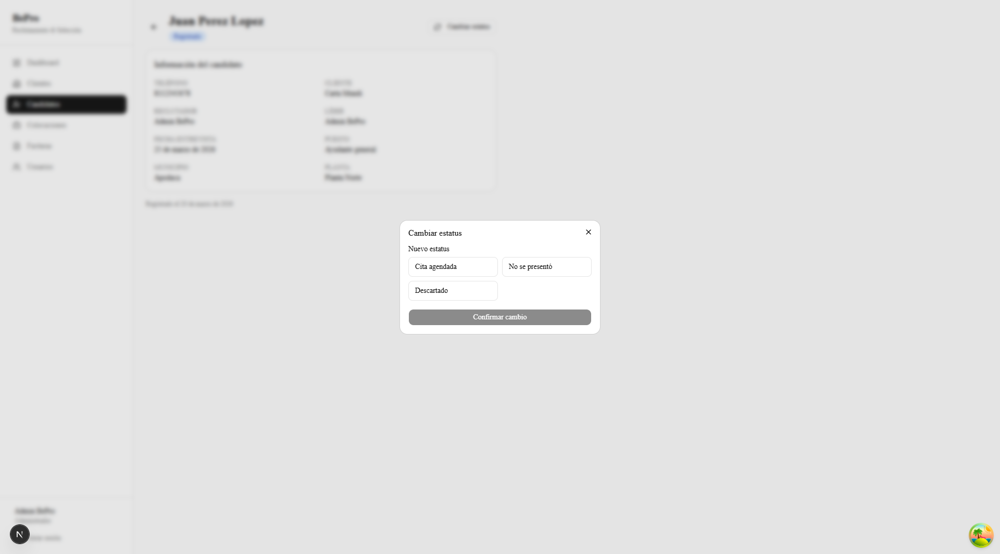

**Flujo de estatus:**

```
Registrado → Cita agendada → Entrevistado → Apto / No apto
                                                  ↓
                                              [Crear colocación]  (solo desde Apto)
```

**Estatus disponibles:**

| Estatus | Descripción |
|---------|-------------|
| Registrado | Candidato recién ingresado al sistema |
| Cita agendada | Se agendó entrevista formal |
| Entrevistado | Ya asistió a entrevista |
| Apto | Aprobado para ingresar |
| No apto | Descartado del proceso |
| No se presentó | No asistió a la cita |
| Descartado | Rechazado en alguna etapa |

> Cuando el candidato alcanza el estatus **Apto**, aparece el panel **Crear colocación** para registrar su ingreso formal.

---

## 6. Módulo Colocaciones

> **Acceso:** Administrador, Gerente, Ejecutivo de cuenta

Seguimiento de candidatos que ya ingresaron a trabajar con una empresa cliente.

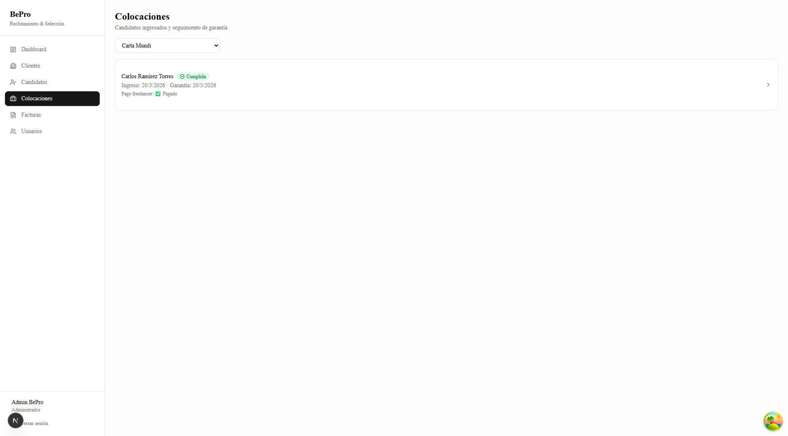

**Selecciona un cliente** para ver las colocaciones activas. Cada colocación muestra:
- Nombre del candidato
- Estado de garantía (En garantía / Cumplida / No cumplida)
- Fecha de ingreso y fin de garantía
- Estado de pago freelancer

### 6.1 Detalle de colocación

Haz clic en una colocación para gestionar su seguimiento.

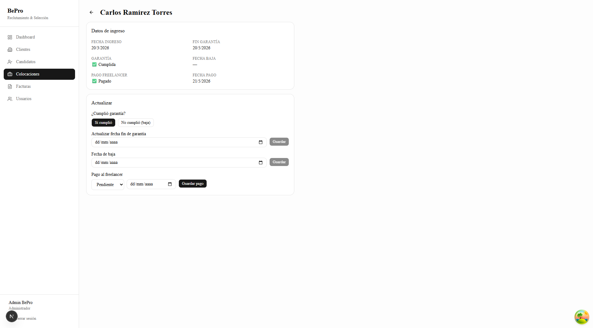

**Acciones disponibles (Admin / Gerente):**

| Acción | Descripción |
|--------|-------------|
| ¿Cumplió garantía? | Registra si el candidato cumplió o no el periodo de garantía |
| Actualizar fecha fin de garantía | Modifica la fecha límite de garantía |
| Fecha de baja | Registra cuándo el candidato dejó la empresa |
| Pago al freelancer | Marca el estado del pago (Pendiente / Pagado / Cancelado) y fecha |

> El campo **Pago al freelancer** solo aplica cuando el candidato fue registrado por un reclutador freelancer.

---

## 7. Roles y permisos

| Módulo | Admin | Gerente | Ejecutivo de cuenta | Reclutador |
|--------|:-----:|:-------:|:-------------------:|:----------:|
| Dashboard | ✅ | ✅ | ✅ | ❌ |
| Clientes (ver) | ✅ | ✅ | ✅ (solo asignados) | ❌ |
| Clientes (crear/editar) | ✅ | ❌ | ❌ | ❌ |
| Usuarios asignados a cliente | ✅ | ✅ | ❌ | ❌ |
| Candidatos (ver) | ✅ | ✅ | ✅ (solo asignados) | ✅ (propios) |
| Candidatos (registrar) | ✅ | ✅ | ✅ | ✅ |
| Candidatos (cambiar estatus) | ✅ | ✅ | ✅ | ❌ |
| Colocaciones | ✅ | ✅ | ✅ | ❌ |
| Facturas | ✅ | ✅ | ❌ | ❌ |
| Usuarios | ✅ | ❌ | ❌ | ❌ |

### Descripción de roles

| Rol | Descripción |
|-----|-------------|
| **Administrador** | Acceso total al sistema. Crea usuarios, clientes y supervisa todas las operaciones |
| **Gerente** | Supervisa equipos completos. Ve todos los clientes y candidatos |
| **Ejecutivo de cuenta** | Gestiona los clientes que tiene asignados y sus candidatos |
| **Reclutador** | Registra candidatos. Ve solo los candidatos que él mismo registró |
| **Reclutador Freelancer** | Igual que Reclutador pero externo a la empresa. Se identifica con el flag `is_freelancer` |

---

*BePro v1.0 — Sistema de Reclutamiento y Selección de Personal*
